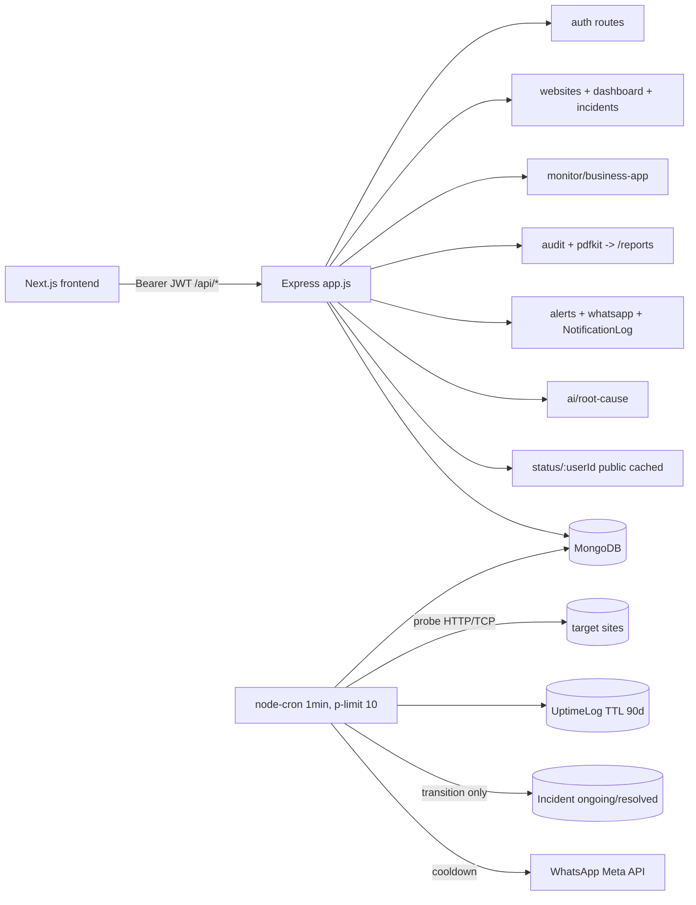

# Architecture

## Boundaries
- **Identity**: register/login + `protect` middleware. All private routes owner-check `userId == req.user.id`.
- **Monitoring**: websites + business-apps share `probe()` + `UptimeLog{websiteId,targetType}` + `Incident`. TCP fallback for CCTV/Tally.
- **Alerting**: `AlertSettings{cooldown,onlyOnStatusChange}` + `NotificationLog` audit trail. Cron alerts only on `up→down` / `down→up`.
- **Evidence**: audit aggregates `UptimeLog` + `Incident` over 30/90/180/365d, streams PDF to disk.
- **Public**: status page is sanitized + cached, no token, masked URLs.

## Resilience
Lock (no overlap) → lean batch 500 → p-limit 10 → 10s timeout → flap guard (2 fails) → transition incidents → cooldown alerts → cron never throws (per-target try/catch, unhandledRejection logged).

## Observability
`morgan` logs, `GET /api/health{mongo,uptime,cronLastRun}`, `NotificationLog` + `Incident` timelines, per-site `avgResponseMs` rolling avg + `consecutiveFailures`.

## Trade-offs
- Single Express service (not microservices): team of 1–3, <10k targets. Split only if alert fan-out needs its own worker.
- `UptimeLog` TTL 90d loses >90d raw evidence; audit `breakdownBySite` snapshot preserves per-report percentages.
- No Redis: cooldown via `NotificationLog` query is fine at this scale; add Redis when checks >1k/min.
